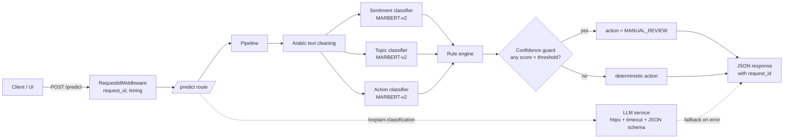

# Text Complaint Analysis API


> Production-grade Arabic complaint classification with a deterministic rule engine and an optional LLM explanation layer. Built as an **AI Systems Engineering** portfolio project — the emphasis is on validation, failure handling, observability, and honest benchmarks.

| | |
|---|---|
| Stack | FastAPI · MARBERT-v2 · OpenAI-compatible LLM · structlog |
| UI | Next.js 16 + Tailwind (`ui/`) |
| Benchmark | 68.3% binary accuracy on OOD Arabic tweets (500 samples) — [REPORT](./benchmarks/REPORT.md) |
| Latency | p50 96 ms · p95 253 ms (CPU, 3 classifiers per request) |
| Error contract | Single envelope with `error_code` + `request_id` correlation |
| Tests | `pytest tests/` |

## Live demo

A Next.js chat-style UI lives in [`ui/`](./ui). Run the API on `:8000` and the UI on `:3000`:

```bash
# terminal 1
uvicorn main:app --reload

# terminal 2
cd ui && npm install && npm run dev
```

Then open <http://localhost:3000> and paste an Arabic complaint.

## Architecture



### Request lifecycle (`POST /predict`)

`Request → RequestIdMiddleware → /predict → Pipeline (clean → sentiment → topic → action → rules → confidence guard) → JSON response`

**Design decisions**

| Decision | Rationale |
|----------|-------------|
| Pipeline runs before any LLM call | Preserves deterministic boundaries; LLM sees fixed labels |
| `llm_service` + `services/llm_prompts.py` | Centralized prompts; routes stay thin |
| OpenAI-compatible HTTP API | Configurable `LLM_BASE_URL` for OpenAI or compatible hosts |
| `response_format: json_object` + Pydantic | Validates structured explanation; rejects malformed output |
| Fallback on failure | Classification always returned; `explanation` may be null |

**LLM failure modes** (`explain_meta`)

| `error_code` / `explain_source` | Meaning |
|---------------------------------|--------|
| `LLM_DISABLED` | `LLM_ENABLED=false` |
| `MISSING_API_KEY` | No `OPENAI_API_KEY` |
| `explain_source: disabled` | LLM not invoked |
| `LLM_TIMEOUT` | Request exceeded `LLM_TIMEOUT_SECONDS` |
| `LLM_HTTP_ERROR` | Non-2xx or network error from provider |
| `LLM_INVALID_RESPONSE` | Unparseable JSON or schema mismatch |
| `explain_source: llm` | Success; `explanation` populated |
| `explain_source: fallback` | LLM failed; see `error_code` |

### Project Structure

```
├── main.py                          # App entry point, lifespan, exception handlers
├── core/
│   └── pipeline.py                  # ML pipeline orchestration + rule engine
├── services/
│   ├── model_loader.py              # HuggingFace model loading
│   ├── sentiment_service.py         # Sentiment classification
│   ├── topic_service.py             # Topic classification
│   ├── action_service.py            # Intent classification
│   ├── llm_service.py               # OpenAI-compatible explanation (timeouts, validation)
│   └── llm_prompts.py               # Prompt templates for the explanation layer
├── interfaces/
│   ├── api/
│   │   ├── predict_route.py         # POST /predict endpoint
│   │   ├── explain_route.py         # POST /explain-classification
│   │   └── middlewares.py           # Request ID + timing middleware
│   └── schemas/
│       ├── complaint.py             # Pydantic request/response models
│       ├── explain.py               # Explain-classification schemas
│       └── enums.py                 # Label enums (Sentiment, Topic, Action)
├── configs/
│   ├── config.py                    # Environment-based settings
│   ├── exceptions.py                # Custom exception classes
│   └── logging.py                   # Structured JSON logging (structlog)
├── utils/
│   └── text_utils.py                # Arabic text normalization
├── tests/
│   ├── test_api.py                  # API endpoint tests
│   ├── test_explain_api.py          # Explain-classification route tests
│   ├── test_llm_service.py          # LLM client and failure-mode tests
│   └── test_pipeline.py             # Pipeline + rule engine tests
├── Dockerfile
├── docker-compose.yml
└── requirements.txt
```

## How It Works

### Models (MARBERT-v2)

| Model | Output | Labels |
|-------|--------|--------|
| Sentiment | Customer emotion | NEG, NEU, POS |
| Topic | Complaint category | FINANCIAL, TECHNICAL, POLICY_SECURITY, CONTENT |
| Intent | User action type | REPORT_BUG, USER_REQUEST, GENERAL_NOTE |

### Rule Engine

The action is determined by combining all three model outputs:

| Condition | Action |
|-----------|--------|
| Topic = POLICY_SECURITY | BLOCK_AND_REVIEW |
| Topic = FINANCIAL + Sentiment = NEG | FINANCIAL_ESCALATION |
| Topic = TECH + Intent = REPORT_BUG | CREATE_JIRA_TICKET |
| Topic = TECH + Sentiment = NEG | TECH_SUPPORT_ESCALATION |
| Topic = CONTENT + Intent = USER_REQUEST | CONTENT_MODIFICATION_QUEUE |
| Sentiment = POS | AUTO_REPLY_THANK_YOU |
| Sentiment = NEU + Intent = GENERAL_NOTE | ARCHIVE_NOTE |
| Default | GENERAL_SUPPORT_ROUTING |

### Confidence Guard

If any model's confidence drops below the threshold, the action is overridden to `MANUAL_REVIEW` to prevent wrong automated decisions.

## Benchmark

The sentiment model is fine-tuned on Saudi government complaints. To measure
**out-of-distribution generalization** (the real production case), it is
benchmarked on a different distribution: general Arabic tweets from
[`arbml/Arabic_Sentiment_Twitter_Corpus`](https://huggingface.co/datasets/arbml/Arabic_Sentiment_Twitter_Corpus).

| Metric | Value |
|---|---|
| Sample size | 500 (stratified, seed 42) |
| Decided predictions (NEG or POS) | 186 / 500 (37.2%) |
| Abstentions (NEU) | 314 (62.8%) — routed to manual review in production |
| **Accuracy on decided** | **68.3%** |
| F1 (POS) | 0.674 |
| Latency p50 | 96 ms (CPU, all 3 classifiers) |
| Latency p95 | 253 ms |
| Pipeline errors | 0% |

Full breakdown, confusion matrix, confidence distributions, and honest caveats: [`benchmarks/REPORT.md`](./benchmarks/REPORT.md).

Reproduce locally:

```bash
python -m benchmarks.run_benchmark --n 500
python -m benchmarks.analyze
```

## Setup

### Environment Variables

Copy the template and edit (never commit `.env`):

```bash
cp .env.example .env
```

`.env.example` is the source of truth for all supported variables (Hugging Face, LLM, confidence guard, operational flags). At minimum, set:

- `HF_TOKEN` — required to download the 3 MARBERT classifiers.
- `OPENAI_API_KEY` — only if you want `/explain-classification` to call the LLM.

### Run with Docker

```bash
docker-compose build
docker-compose up
```

The API will be available at `http://localhost:8000`.

### Run Locally

Using `uv` (recommended):

```bash
uv venv
source .venv/bin/activate
uv pip install -r requirements.txt
uvicorn main:app --reload
```

Or plain `venv`:

```bash
python -m venv .venv
source .venv/bin/activate    # Windows: .venv\Scripts\activate
pip install -r requirements.txt
uvicorn main:app --reload
```

## Startup & Model Loading

On startup, the app:

1. Verifies `HF_TOKEN`.
2. Downloads and loads sentiment, topic, and action models in order.

### Strict vs degraded startup

| `ALLOW_DEGRADED_STARTUP` | Behavior | When to use |
|--------------------------|----------|-------------|
| `false` (default) | App fails to start if any model fails to load. `/ready` returns 503. | Production, staging, anywhere health checks gate traffic. |
| `true` | App still starts even if models fail. `/ready` still returns 503, so traffic is still blocked. | Local debugging only (e.g., exploring routes/docs without waiting on model downloads). |

### First-run notes

- First boot downloads ~1.5–2 GB of model weights. Allow 1–2 minutes.
- Models are cached under `~/.cache/huggingface/` (or the container's default cache dir).
- Subsequent restarts load from cache and are fast.

### Hugging Face models: 404 / “Repository Not Found”

The default model IDs (`Ysfxjo/marbert-complaint-sentiment`, etc.) must exist on the Hub **and** your `HF_TOKEN` must be allowed to read them (public repos work with any valid token; **private** repos require a token from an account with access).

- If you see **404** on `config.json` or **`additional_chat_templates`**: confirm the repo URL in the browser while logged in, or set **`HF_MODEL_SENTIMENT`**, **`HF_MODEL_TOPIC`**, **`HF_MODEL_ACTION`** in `.env` to repos you control. The service code expects classifier outputs **`LABEL_0`, `LABEL_1`, …** as in the original fine-tunes; other checkpoints need matching label maps in `services/*_service.py`.
- This repo pins **`transformers` 4.x** (`requirements.txt`) to avoid extra Hub fetches that some **v5** installs trigger on text-classification models. After pulling changes, run: `pip install -r requirements.txt` again.

## API Endpoints

### POST /explain-classification

Runs the same pipeline as `/predict`, then optionally calls the LLM to produce a **structured explanation** (`summary`, `rationale`, `limitations`). If the LLM is disabled, misconfigured, or fails, the response still includes the full `classification`; `explanation` may be `null` and `explain_meta` describes why.

```bash
curl -X POST http://localhost:8000/explain-classification \
  -H "Content-Type: application/json" \
  -d '{"text": "التطبيق يعلق عند الدفع"}'
```

### POST /predict

```bash
curl -X POST http://localhost:8000/predict \
  -H "Content-Type: application/json" \
  -d '{"text": "حولت مبلغ ومارجع لي وخدمة العملاء ما ردوا علي"}'
```

Response:
```json
{
  "sentiment": {
    "label": "NEG",
    "confidence": 0.58,
    "explanation": "Sentiment: LABEL_0 -> NEG",
    "low_confidence": true
  },
  "topic": {
    "label": "FINANCIAL",
    "confidence": 1.0,
    "explanation": "Topic: LABEL_1 -> FINANCIAL",
    "low_confidence": false
  },
  "intent": {
    "label": "USER_REQUEST",
    "confidence": 1.0,
    "explanation": "Action: LABEL_1 -> USER_REQUEST",
    "low_confidence": false
  },
  "action": {
    "label": "FINANCIAL_ESCALATION",
    "decision_source": "RULE_ENGINE"
  },
  "meta": {
    "model_version": "MARBERT-v2"
  }
}
```

### GET /health

Liveness probe. Returns `{"status": "ok"}` whenever the process is alive — does **not** reflect model readiness.

### GET /ready

Readiness probe. Returns:

- `200 {"status": "ready"}` when all 3 classifiers are loaded.
- `503` with `error_code: MODELS_NOT_READY` otherwise.

Use `/ready` for load balancer / Kubernetes `readinessProbe` so unready instances don't receive traffic. Use `/health` only for liveness.

## Observability

### Structured Logging

All logs are JSON-formatted via structlog. Every request gets a unique `request_id` that appears in all related logs:

```json
{"event": "pipeline_started", "request_id": "c72dc0a5-...", "path": "/predict", "method": "POST"}
{"event": "sentiment_predicted", "label": "NEG", "confidence": 0.58, "request_id": "c72dc0a5-..."}
{"event": "Request completed", "status_code": 200, "duration_ms": 234.41, "request_id": "c72dc0a5-..."}
```

### Error Contract

All error responses follow one envelope:

```json
{
  "error": "ERROR_NAME",
  "error_code": "STABLE_CODE",
  "message": "Human readable summary",
  "details": {},
  "request_id": "uuid"
}
```

`request_id` also appears in the `x-request-id` response header, so client logs and server logs can be correlated.

| HTTP | error_code | When |
|------|------------|------|
| 422  | `INVALID_REQUEST` | Pydantic validation failed (empty text, missing field, etc.) |
| 503  | `MODELS_NOT_READY` | App is up but models are not loaded (see `/ready`) |
| 503  | `MODEL_LOAD_ERROR` | A specific model failed during load |
| 400  | `CONFIG_ERROR` | Missing/invalid env var (e.g., `HF_TOKEN`) |
| 500  | `PREDICTION_ERROR` | Classifier returned unexpected output (e.g., unknown label) — no silent fallback |
| 500  | `UNHANDLED_EXCEPTION` | Any unhandled server error |
| 4xx  | `HTTP_<code>` | Generic HTTP error (e.g., `HTTP_404` Not Found) |

LLM failures on `/explain-classification` do **not** return HTTP errors. The deterministic `classification` is always returned; check `explain_meta.error_code` and the optional `explanation` field.

## Known Failures & Ops Notes

| Symptom | Likely cause | Fix |
|---------|--------------|-----|
| `/health` is 200 but `/predict` returns 503 `MODELS_NOT_READY` | Models did not load successfully | Check startup logs for `model_loading_failed` and `hf_token_check` |
| HF 404 on `config.json` during model load | `HF_TOKEN` lacks access to a model repo, or repo ID changed | Verify repo in browser while logged in, or override `HF_MODEL_*` env vars |
| First request to `/predict` is slow (~2-5s) | Cold model warm-up / first cache fill | Expected — subsequent requests are fast |
| `/explain-classification` returns `explanation: null` | LLM disabled, missing key, timed out, or returned invalid JSON | Inspect `explain_meta.error_code` (`LLM_DISABLED`, `MISSING_API_KEY`, `LLM_TIMEOUT`, `LLM_HTTP_ERROR`, `LLM_INVALID_RESPONSE`) |
| `prediction_log_failed` warning in logs | `logs/predictions.json` is corrupt or not writable | Logging is best-effort and never fails the request; safe to delete the file to reset |

## Tests

```bash
pytest tests/ -v
```

## Tech Stack

| Component | Technology |
|-----------|------------|
| Framework | FastAPI |
| NLP | HuggingFace Transformers (MARBERT-v2) |
| Optional LLM | OpenAI-compatible API via httpx (async, timeouts) |
| Validation | Pydantic v2 |
| Logging | structlog (JSON) |
| Container | Docker + docker-compose |
| Server | Uvicorn |
