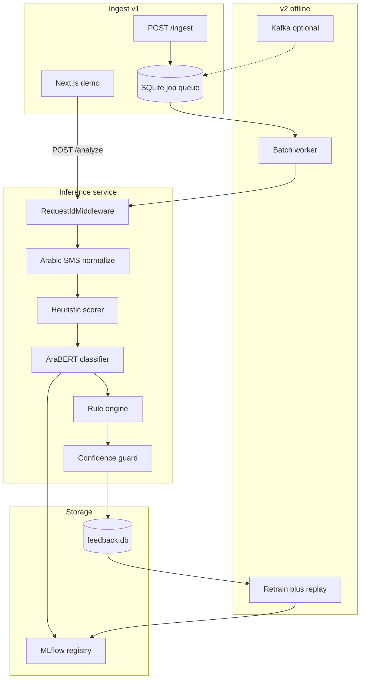

# ScamShield AR — Implementation Plan

**Status:** Planning document (implementation not started).  
**Location:** [`docs/SCAMSHIELD_IMPLEMENTATION_PLAN.md`](SCAMSHIELD_IMPLEMENTATION_PLAN.md) in `text-complaint-api` until you create the new repo.  
**Target repo:** `scamshield-ar` (new repository — do not use unpublished MARBERT complaint weights).  
**Builder:** You implement this yourself; this file is the single source of truth for scope, data, architecture, phases, and acceptance criteria.

---

## Implementation checklist

- [ ] Create `scamshield-ar` repo: folder tree, CI, `.env.example`, LICENSE, README stub
- [ ] Download SpamShield Arabic + synthetic holdout JSONL + `build_splits.py` + baseline TF-IDF
- [ ] Implement `core/heuristics.py` with Arabic URL/urgency/bank patterns + unit tests
- [ ] (Optional) Benchmark [M-Arjun/SpamShield](https://huggingface.co/M-Arjun/SpamShield) ONNX vs TF-IDF on Arabic + Gulf holdout (§5.0)
- [ ] Fine-tune AraBERT-Twitter, MLflow logging, push public Hub model, error analysis
- [ ] Build FastAPI pipeline (normalize → heuristics → ML → rules → guard), tests, Docker
- [ ] Next.js demo + `benchmarks/REPORT.md` + README repro path
- [ ] (v2) Feedback DB, `/feedback`, label queue export, retrain + replay + promotion gates
- [ ] (v2 optional) SQLite queue → Kafka worker in docker-compose

---

## 1. Product definition

### Problem

Arabic users receive SMS/WhatsApp-style messages that impersonate banks, carriers, and government entities. A portfolio-grade system should **triage** messages with **safe defaults** (abstain when unsure), not just predict “spam.”

### User-facing behavior

| Input | Output |
|-------|--------|
| Raw Arabic message (paste or batch) | `threat`: `LEGIT` \| `SUSPICIOUS` \| `SCAM` |
| | `category` (optional fine grain): `phishing`, `financial_fraud`, `marketing`, `ham`, … |
| | `action`: `IGNORE` \| `WARN_USER` \| `BLOCK_SENDER` \| `REPORT` \| `MANUAL_REVIEW` |
| | Per-field confidence + `decision_source` (`MODEL`, `RULE_ENGINE`, `HEURISTIC`, `CONFIDENCE_THRESHOLD`) |
| | `request_id` on every response |

### Non-goals for v1

- Real SMS interception on Android (no BroadcastReceiver)
- vLLM as primary classifier
- Unpublished complaint corpora or MARBERT complaint checkpoints
- Kubernetes / Triton

### What makes this publishable (vs generic spam notebooks)

1. **Hybrid detection** (industry best practice from [Hook](https://github.com/Basit-Balogun10/hook), [ISEA SMS Guard](https://github.com/lovnishverma/ISEA-Hackathon)): ML + **Arabic heuristics** (URL, urgency, bank keywords).
2. **Systems layer**: rules + confidence guard + unified errors (same maturity as Complaint Analyst / `text-complaint-api`).
3. **Honest eval**: in-domain + **adversarial OOD** set (Gulf-style scams you hold out).
4. **Public lineage**: [SpamShield Datasets](https://huggingface.co/datasets/M-Arjun/SpamShield-Datasets) (CC-BY-4.0) + [AraBERT-Twitter](https://huggingface.co/aubmindlab/bert-base-arabertv02-twitter) or [CAMeLBERT-DA](https://huggingface.co/CAMeL-Lab/bert-base-arabic-camelbert-da).

---

## 2. Recommended architecture



**Design principle (from Complaint Analyst):** ML supplies **signals**; **code** decides **action**. Heuristics act as a **safety net** for high-recall scam patterns (URLs, shorteners, “حسابك موقوف”, etc.).

---

## 3. Label and schema design

### 3.1 Primary threat enum (model head)

| Label | Meaning | Typical action |
|-------|---------|----------------|
| `LEGIT` | Normal / ham | `IGNORE` |
| `SUSPICIOUS` | Ambiguous or weak signals | `WARN_USER` or `MANUAL_REVIEW` |
| `SCAM` | Fraud/phishing intent | `BLOCK_SENDER` / `REPORT` |

**Training mapping from SpamShield `category`:**

| SpamShield `category` | Map to threat |
|----------------------|---------------|
| `normal` | `LEGIT` |
| `phishing`, `job_scam`, `giveaway`, `crypto`, `scam` | `SCAM` |
| `spam`, `marketing`, `promo`, `adult` | `SUSPICIOUS` (or `SCAM` if stricter; document in REPORT) |

Filter `language == "Arabic"` (~1,246 rows per [dataset card](https://huggingface.co/datasets/M-Arjun/SpamShield-Datasets)).

### 3.2 Rule engine (after ML)

Implement in `core/routing.py`:

| Condition | Action | `decision_source` |
|-----------|--------|-------------------|
| `threat == SCAM` + `has_url` | `REPORT` | `RULE_ENGINE` |
| `threat == SCAM` | `BLOCK_SENDER` | `RULE_ENGINE` |
| `threat == SUSPICIOUS` | `WARN_USER` | `RULE_ENGINE` |
| `threat == LEGIT` | `IGNORE` | `RULE_ENGINE` |
| Any score below threshold | `MANUAL_REVIEW` | `CONFIDENCE_THRESHOLD` |
| Heuristic score >= critical | force `SCAM` path | `HEURISTIC` |

### 3.3 Heuristic layer

Port the **idea** of [SMS Guard semantic features](https://github.com/lovnishverma/ISEA-Hackathon) for Arabic:

| Feature group | Examples (Arabic patterns) |
|---------------|--------------------------|
| URL | `http`, shorteners, raw IP, suspicious TLD |
| Urgency | فوري، آخر فرصة، خلال 24 ساعة |
| Bank/gov spoof | الراجحي، stc، أبشر، وزارة (configurable keyword list) |
| OTP/password | رمز التحقق، كلمة المرور |
| Obfuscation | excessive Latin digits, mixed scripts |

Return `heuristic_score` 0–1 and `heuristic_flags: list[str]` in response `meta`.

**Best practice:** heuristics must not silently override `LEGIT` to `SCAM` without logging; set `decision_source=HEURISTIC` and tune false positives on ham set.

---

## 4. Data plan

### 4.1 Core dataset (public)

- **Primary:** [M-Arjun/SpamShield-Datasets](https://huggingface.co/datasets/M-Arjun/SpamShield-Datasets) — request access (CC-BY-4.0), load `combined.parquet`, filter Arabic.
- **Split:** 70% train / 15% val / 15% test, stratified by mapped `threat`, seed=42.
- **Leakage check:** duplicate `text` hash across splits (reuse `overlap_check` from `arabic-complaint-xai-fl/scripts/evaluate.py`).

### 4.2 Required augmentation (you create)

Arabic-only **~150–300 synthetic messages** in `data/synthetic/`:

| Bucket | Count | Purpose |
|--------|-------|---------|
| Gulf bank phishing (MSA + Khaleeji) | 50 | Demo + OOD holdout |
| Package delivery / customs scams | 30 | Common MENA pattern |
| Legit bank OTP (ham) | 40 | Reduce false positives |
| Benign promotional (ham) | 30 | Hard negatives |

Store as `data/synthetic/messages.jsonl`: `text`, `threat`, `source`, `split` (`train` | `holdout_only`).

**Holdout-only** rows never enter training — used only in `benchmarks/REPORT.md` as adversarial OOD.

### 4.3 Optional second source

- Arabic-translated UCI SMS Spam ([AraBERT SMS paper](https://sciety.org/articles/activity/10.21203/rs.3.rs-6832100/v1)) — only if license is clear.

### 4.4 Baseline (week 1 gate)

TF-IDF + Logistic Regression on same splits (mirror `arabic-complaint-xai-fl/scripts/train_baseline.py`) — target ~85%+ in-domain accuracy before BERT fine-tune.

---

## 5. Model plan

### 5.0 Pre-built model landscape (deep search, May 2026)

**Question:** Public data exists ([SpamShield-Datasets](https://huggingface.co/datasets/M-Arjun/SpamShield-Datasets)); is there already a **downloadable model** that does ScamShield’s job (`LEGIT` / `SUSPICIOUS` / `SCAM` + Gulf SMS + your pipeline)?

**Answer:** **Data yes, exact model no.** You should **fine-tune** a public Arabic encoder on public data (and your synthetic Gulf holdout). You are **not** training BERT from scratch.

#### How this survey was done

| Step | What we ran |
|------|-------------|
| Hugging Face Hub API | Model search: `arabic spam sms`, `arabic spam`, `spamshield`, `arabert spam`, `sms spam`, `phishing sms`, `smishing`, `multilingual spam`, `scam detection`, etc. (~50+ unique repos after de-duplication) |
| Hugging Face Hub API | Dataset search: `arabic spam sms`, `spamshield`, `sms spam multilingual`, `arabic scam` |
| Model cards | Read cards for every Arabic-related or SpamShield-related hit with downloads > 0 or explicit `ar` tag |
| Papers / GitHub | Cross-check cited work (AraBERT SMS, AraSpam, hybrid ensemble 2025, smishing datasets) for **published weights** on Hub |

**Survey date:** May 2026. Re-run `hf search models "arabic spam"` before v1 ship if months pass.

#### What ScamShield needs (acceptance criteria for “already built”)

| Requirement | Why most models fail |
|-------------|----------------------|
| **Arabic SMS / short message** (not email, not long tweets) | Many “spam” models are English UCI SMS or email |
| **Transformer + `transformers` pipeline** (same stack as Complaint Analyst) | [M-Arjun/SpamShield](https://huggingface.co/M-Arjun/SpamShield) is **sklearn + ONNX n-grams**, not AraBERT |
| **Threat triage** `LEGIT` \| `SUSPICIOUS` \| `SCAM` + rule/guard layer | Most checkpoints are **binary** spam/ham only |
| **Public weights + license** you can cite on LinkedIn | Papers often report 95–99% but **no Hub checkpoint** |
| **Your retrain loop** (feedback → new Hub version → MLflow) | Third-party ONNX product has **their** release cycle, not yours |

#### Tier A — Closest pre-built (use as baseline or week-1 stub, not final portfolio ML)

| Asset | Type | Arabic SMS? | Fits API labels? | Verdict |
|-------|------|-------------|------------------|---------|
| [M-Arjun/SpamShield](https://huggingface.co/M-Arjun/SpamShield) | **sklearn + ONNX** (binary + 6 categories) | Yes; card cites ~**91.7% F1** Arabic | Map `ham`→`LEGIT`, categories→`SCAM`/`SUSPICIOUS` in **rules** | **Best off-the-shelf scorer** for quick demo; **not** AraBERT; ~0 Hub downloads at survey time |
| [M-Arjun/SpamShield-Datasets](https://huggingface.co/datasets/M-Arjun/SpamShield-Datasets) | CC-BY-4.0 data | **1,246** Arabic rows (623 ham / 623 spam) | Train **your** head; dataset page lists **2** community classifiers (no widely adopted AraBERT SMS scam model) | **Primary training corpus** |
| [Abhishek1805/spamshield-xlmr](https://huggingface.co/Abhishek1805/spamshield-xlmr) | XLM-R (~278M), **no model card** | Unknown | Unknown | Experimental; **not** production-ready |
| [AmmarJamali/spamshield-distilbert](https://huggingface.co/AmmarJamali/spamshield-distilbert) | DistilBERT (~67M), **no model card** | Unknown | Unknown | Same |
| [itxsalmannkhann/Spam-Shield](https://huggingface.co/itxsalmannkhann/Spam-Shield) | Unclear fork | Unknown | Unknown | Ignore unless card + eval added |

**SpamShield product architecture (important):** char/word **n-gram** models (~3–5 MB ONNX), not `AutoModelForSequenceClassification` on AraBERT. Fast CPU, different failure modes than your planned BERT stack.

#### Tier B — Arabic BERT on Hub, **wrong task** (do not plug in as threat classifier)

| Model | Task | Downloads (approx.) | Why not ScamShield ML |
|-------|------|---------------------|------------------------|
| [Abdelkareem/arabic_tweets_spam_or_ham](https://huggingface.co/Abdelkareem/arabic_tweets_spam_or_ham) | Twitter spam/ham | ~5/mo | **Tweets**, not SMS; dataset private/unspecified; tiny usage |
| [saifholaiel/arabic_tweets_spam_or_ham](https://huggingface.co/saifholaiel/arabic_tweets_spam_or_ham) | Same family | ~2 | Same |
| [SoftALL/OBSIDIAN](https://huggingface.co/SoftALL/OBSIDIAN) | Social “threat” classes | Low | **Twitter intelligence**, not SMS triage |
| [sabaridsnfuji/arabic-ai-text-detector](https://huggingface.co/sabaridsnfuji/arabic-ai-text-detector) | Human vs AI text | — | Wrong label space |
| [Woolv7007/egyptian-text-classification](https://huggingface.co/Woolv7007/egyptian-text-classification) | Hate / ads (6-way) | — | Safety, not scam |
| [FerasMad/arabic-complaints-classifier](https://huggingface.co/FerasMad/arabic-complaints-classifier) | Restaurant complaints | — | Different domain |
| [imaneumabderahmane/Arabertv2-classifier-FA](https://huggingface.co/imaneumabderahmane/Arabertv2-classifier-FA) | First-aid intent | — | Wrong task |

**Conclusion:** Plenty of **AraBERT fine-tunes**, almost none for **Arabic SMS scam triage** with a public card and eval you can trust.

#### Tier C — SMS / spam models, **not Arabic-first**

| Model | Downloads (approx.) | Language | Notes |
|-------|---------------------|----------|--------|
| [mrm8488/bert-tiny-finetuned-sms-spam-detection](https://huggingface.co/mrm8488/bert-tiny-finetuned-sms-spam-detection) | ~40k | English (UCI SMS) | High downloads; wrong language |
| [notd5a/deberta-v3-malicious-sms-mms-detector-v0.2.2](https://huggingface.co/notd5a/deberta-v3-malicious-sms-mms-detector-v0.2.2) | ~1k+ | **English-only** (card limitation) | Strong smishing; use as **methodology** reference only |
| [tanaos/tanaos-spam-detection-v1](https://huggingface.co/tanaos/tanaos-spam-detection-v1) | ~359 | Card: **English** primary; separate per-language SKUs | Synthetic training data; weak Gulf dialect claim |
| [nahiar/spam-detection-xlm-roberta-v1](https://huggingface.co/nahiar/spam-detection-xlm-roberta-v1) | ~590 | Indonesian / English social | Not SMS Arabic |
| [baptistejamin/xlm-roberta-large-spam_v4](https://huggingface.co/baptistejamin/xlm-roberta-large-spam_v4) | ~307 | Multilingual email/spam | Not Arabic SMS–specific |
| [BaranKanat/BerTurk-SpamSMS](https://huggingface.co/BaranKanat/BerTurk-SpamSMS) | Low | Turkish SMS | Good **pattern** (BERT + SMS), wrong language |
| [SharpWoofer/distilroberta-sms-spam-detector](https://huggingface.co/SharpWoofer/distilroberta-sms-spam-detector) | Low | English UCI | Baseline comparison only |

#### Tier D — Research & GitHub (high metrics, **weights usually missing**)

| Source | Reported result | Public HF weights for Arabic SMS scam? |
|--------|-----------------|----------------------------------------|
| [Arabic SMS + AraBERT + CNN-BiLSTM (2024)](https://sciety.org/articles/activity/10.21203/rs.3.rs-6832100/v1) | ~99% MSA, ~95% Iraqi dialect | **No** standard model id found |
| [AraSpam — Arabic Twitter multitask (2025)](https://thesai.org/Publications/ViewPaper?Code=IJACSA&Issue=8&SerialNo=16&Volume=16) | ~96% account + tweet spam | Twitter, not SMS; weights not on Hub |
| [Hybrid ensemble Arabic SMS scam (JISEM, Feb 2025)](https://www.jisem-journal.com/index.php/journal/article/download/11434/5313/19181) | ~91.9% accuracy, **673** survey SMS | Classical ML; **no** Hub release |
| [BiGRU Arabic SMS phishing (2025)](https://www.koreascience.kr/article/JAKO202513954006483.page) | ~98.7% | TF-IDF + RNN; no Hub |
| [jaberjaber23/Arabic_SMS_Detection_Project](https://github.com/jaberjaber23/Arabic_SMS_Detection_Project) | ~97.85% (AraBERT + CNN/LSTM) | Code repo; **not** a maintained `aubmindlab/...`–style checkpoint |
| [shaghayegh-hp/Smishing_Dataset](https://github.com/shaghayegh-hp/Smishing_Dataset) | Combined smishing CSV | English-centric sources; relabeled; not Gulf Arabic |
| [dbarbedillo/SMS_Spam_Multilingual_Collection_Dataset](https://huggingface.co/datasets/dbarbedillo/SMS_Spam_Multilingual_Collection_Dataset) | UCI → many langs via **M2M100** | Arabic is **machine-translated**, not native Gulf scams; optional extra train only |

#### Gap summary (why fine-tune anyway)

```text
┌─────────────────────────────────────────────────────────────────┐
│  PUBLIC DATA (SpamShield Arabic ~1.2k + your synthetic Gulf)   │
└───────────────────────────────┬─────────────────────────────────┘
                                │
        ┌───────────────────────┼───────────────────────┐
        ▼                       ▼                       ▼
  SpamShield ONNX          No AraBERT SMS           English SMS
  (Tier A, fast)           scam model on Hub        DeBERTa / UCI
  different stack          (Tier B gap)             (Tier C)
        │                       │                       │
        └───────────────────────┴───────────────────────┘
                                │
                    Fine-tune AraBERT-Twitter (Tier E)
                    → YOUR_USER/scamshield-ar-arabert-v1
                    → MLflow + v2 retrain from feedback.db
```

| Layer | Exists publicly? | You build |
|-------|------------------|-----------|
| Labeled Arabic spam/SMS **data** | Yes (SpamShield, optional translated UCI) | Synthetic Gulf **holdout** (required) |
| **Production Arabic SMS triage** model (3-class + your guards) | **No** trusted checkpoint | Fine-tune + Hub + REPORT |
| **Systems** (heuristics, rules, confidence guard) | Patterns in Hook / ISEA / Complaint Analyst | `core/pipeline.py` |

#### Recommended strategy (locked for this plan)

| Phase | ML slot | Purpose |
|-------|---------|---------|
| **Week 1 (optional)** | [M-Arjun/SpamShield](https://huggingface.co/M-Arjun/SpamShield) ONNX **or** TF-IDF baseline | Prove pipeline + latency before GPU fine-tune |
| **Week 2 (required for portfolio)** | Fine-tune [AraBERT-Twitter](https://huggingface.co/aubmindlab/bert-base-arabertv02-twitter) on SpamShield Arabic + synthetic **train** split | **Your** public weights, same stack as complaint API |
| **v2** | Retrain on `feedback.db` + replay | New Hub version + MLflow promotion gates |

**“Fine-tune” means:** load pretrained encoder (~110M params) → train classification head 3–5 epochs on ~1.5k–2k labeled rows → push adapter weights (~440 MB). **Not** pretraining from random init.

#### Optional week-1 comparison table (document in `benchmarks/REPORT.md`)

| Candidate | Run on Arabic test split? | Run on Gulf holdout? |
|-----------|---------------------------|----------------------|
| TF-IDF + LogReg (mandatory gate) | Yes | Yes |
| SpamShield ONNX (optional) | Yes | Yes |
| **Your AraBERT v1** (primary) | Yes | Yes |

If SpamShield ONNX beats your v1 on **Gulf holdout**, still ship AraBERT for portfolio/retrain story; note honest result in REPORT (ensemble is v2 idea only).

---

### 5.1 Base checkpoint (pick one)

| Model | When to use |
|-------|-------------|
| [aubmindlab/bert-base-arabertv02-twitter](https://huggingface.co/aubmindlab/bert-base-arabertv02-twitter) | **Default** — informal SMS |
| [CAMeL-Lab/bert-base-arabic-camelbert-da](https://huggingface.co/CAMeL-Lab/bert-base-arabic-camelbert-da) | More dialectal synthetic data |

### 5.2 Fine-tuning (`training/`)

- Hugging Face `Trainer`, `max_length=128`
- `metric_for_best_model=f1_macro`, early stopping patience=2
- Class weights if `SCAM` is minority
- MLflow logging; push to Hub: `YOUR_USER/scamshield-ar-arabert-v1`

### 5.3 Inference

- `transformers` `pipeline("text-classification", top_k=3)`
- Map `LABEL_*` → `ThreatLabel` in `services/threat_service.py`
- Reuse pattern from `text-complaint-api/services/classifier_service.py`

---

## 6. Repository structure

```text
scamshield-ar/
├── README.md
├── LICENSE
├── .env.example
├── docker-compose.yml
├── Dockerfile
├── requirements.txt
├── pyproject.toml
├── docs/
│   ├── SCAMSHIELD_IMPLEMENTATION_PLAN.md
│   ├── ARCHITECTURE.md
│   └── API.md
├── api/
│   ├── main.py
│   ├── configs/
│   ├── core/
│   │   ├── pipeline.py
│   │   ├── routing.py
│   │   └── heuristics.py
│   ├── services/
│   │   ├── model_loader.py
│   │   ├── classifier_service.py
│   │   └── threat_service.py
│   ├── interfaces/
│   ├── utils/
│   │   └── text_utils.py
│   └── tests/
├── training/
│   ├── data/
│   ├── scripts/
│   │   ├── download_spamshield.py
│   │   ├── build_splits.py
│   │   ├── train_baseline.py
│   │   └── train_classifier.py
│   └── notebooks/
│       └── 01_eda.ipynb
├── benchmarks/
│   ├── run_benchmark.py
│   ├── analyze.py
│   └── REPORT.md
├── worker/
│   └── consume_queue.py
├── registry/
├── ui/
└── .github/workflows/ci.yml
```

**Reuse from `text-complaint-api`:** lifespan, `error_envelope`, `RequestIdMiddleware`, `get_model_loader`, Pydantic schemas, Docker/CI — copy and rename; do not import across repos.

---

## 7. API contract (v1)

| Method | Path | Purpose |
|--------|------|---------|
| `POST` | `/analyze` | Single message (demo) |
| `POST` | `/analyze/batch` | Batch messages |
| `POST` | `/ingest` | Enqueue for worker (v1 SQLite) |
| `GET` | `/health` | Liveness |
| `GET` | `/ready` | Model loaded |
| `POST` | `/feedback` | v2: human correction |

**Response (essential fields):**

```json
{
  "threat": "SCAM",
  "category": "phishing",
  "confidence": 0.91,
  "action": { "label": "REPORT", "decision_source": "RULE_ENGINE" },
  "heuristics": { "score": 0.8, "flags": ["has_url", "urgency"] },
  "meta": { "model_version": "arabert-v1", "request_id": "..." }
}
```

---

## 8. Phase v1 — LinkedIn-ready (4–6 weeks)

### Week 1 — Data + baselines + heuristics

| Task | Done when |
|------|-----------|
| Create repo, CI, `.env.example` | `pytest` runs |
| Download SpamShield, filter Arabic, EDA | Class distribution documented |
| `build_splits.py` + synthetic JSONL | No holdout leakage |
| `train_baseline.py` | `results/baseline.json` saved |
| `heuristics.py` unit tests | 10 Arabic fixtures pass |

### Week 2 — Fine-tune + evaluate

| Task | Done when |
|------|-----------|
| `train_classifier.py` + MLflow | Val F1 macro logged |
| AraBERT vs baseline | BERT wins on val |
| Push public Hub model | Model card + CC-BY attribution |
| Error analysis | Confusion matrix documented |

**Acceptance:** In-domain test F1 macro ≥ 0.80 (document if lower). **LEGIT recall ≥ 0.85**.

### Week 3 — API + pipeline

| Task | Done when |
|------|-----------|
| Full `run_pipeline` | Same flow as `core/pipeline.py` in complaint API |
| Exception handlers + structlog | Unified error envelope |
| Tests ≥ 15 | CI green |
| Docker compose | `/ready` returns 200 |

### Week 4 — UI + benchmark + docs

| Task | Done when |
|------|-----------|
| Next.js demo (6 scams + 3 legit presets) | Screenshot-ready |
| `benchmarks/run_benchmark.py` | `REPORT.md` generated |
| README + architecture diagram | Stranger can reproduce |
| LinkedIn post | Only public Hub + dataset links |

**v1 done:** Clone → `HF_TOKEN` → API + UI → reproduce `benchmarks/REPORT.md`.

---

## 9. Phase v2 — Curriculum arc (weeks 5–8)

### 9.1 Human-in-the-loop + active learning

| Component | Implementation |
|-----------|----------------|
| `feedback` table | SQLite: `message_id`, `text_hash`, `predicted_threat`, `corrected_threat`, `timestamp` |
| `POST /feedback` | Overrides from UI or `MANUAL_REVIEW` |
| Active learning | `export_label_queue.py` — top 50 lowest confidence / week |
| Relabel | Admin page or CSV round-trip |

### 9.2 Offline learnable pipeline

Pattern from [ml-retraining-pipeline](https://github.com/Emmimal/ml-retraining-pipeline/):

```text
merge(feedback + warehouse) → replay 15% old → train → eval golden + holdout
→ if gates pass → registry/production.json → new HF_MODEL_THREAT
```

**Promotion gates:**

- `LEGIT` recall must not drop > 2% vs production
- `SCAM` F1 must not drop > 2%
- Holdout adversarial: zero regressions on `SCAM` rows

### 9.3 Event ingest (Kafka optional)

| v1 | v2 |
|----|-----|
| `POST /ingest` → SQLite `jobs` | Same → Kafka `messages.raw` |
| `worker/consume_queue.py` polls SQLite | Kafka consumer group |

### 9.4 Explainability (optional)

- SHAP or LIME notebook on 20 holdout examples — do not block v1

---

## 10. Benchmarks and metrics

### In-domain (SpamShield Arabic test)

- Per-class precision / recall / F1 for `LEGIT`, `SUSPICIOUS`, `SCAM`
- Confusion matrix (focus on LEGIT → SCAM errors)
- Latency p50 / p95 on CPU

### OOD (synthetic `holdout_only`)

- Recall on `SCAM` holdout
- False positive rate on legit holdout

### End-to-end

- % `MANUAL_REVIEW`
- % overridden by heuristics

---

## 11. Config (`.env.example`)

```bash
HF_TOKEN=
HF_MODEL_THREAT=YOUR_USER/scamshield-ar-arabert-v1
THREAT_THRESHOLD=0.75
ENABLE_HEURISTICS=true
ENABLE_CONFIDENCE_GUARD=true
MLFLOW_TRACKING_URI=file:./mlruns
ALLOW_DEGRADED_STARTUP=false
# v2
DATABASE_URL=sqlite:///./data/feedback.db
KAFKA_BOOTSTRAP=
```

---

## 12. Risks and mitigations

| Risk | Mitigation |
|------|------------|
| Small Arabic set (~1.2k) | Synthetic data + honest REPORT |
| Overfitting SpamShield style | Gulf holdout + per-class eval |
| Heuristic false positives on legit bank SMS | Legit OTP in synthetic; tune thresholds |
| HF dataset access gated | Request early; cache JSONL in `data/raw/` |
| LinkedIn confusion with complaint API | Two repos; public artifacts only on ScamShield |

---

## 13. Course curriculum mapping

| Course step | ScamShield feature |
|-------------|-------------------|
| Kafka / event pipelines | v2 ingest + worker |
| Arabic NLP fine-tune | `train_classifier.py` |
| MLOps / MLflow / CI | Registry + GitHub Actions |
| Rule engines + XAI | `routing.py` + optional SHAP |
| HITL / active learning | `/feedback` + label queue |
| Performance | `/analyze/batch` + latency in REPORT |
| Stakeholder docs | `docs/EXEC_SUMMARY.md` |

---

## 14. GitHub Issues order

1. Repo scaffold + CI  
2. Data + splits + synthetic holdout  
3. Baseline TF-IDF  
4. Heuristics + tests  
5. AraBERT fine-tune + Hub  
6. API pipeline + tests  
7. Docker + README  
8. UI demo  
9. Benchmark REPORT  
10. (v2) Feedback → retrain → optional Kafka  

---

## 15. References

| Resource | Why |
|----------|-----|
| [SpamShield Datasets](https://huggingface.co/datasets/M-Arjun/SpamShield-Datasets) | Primary data (CC-BY-4.0) |
| [M-Arjun/SpamShield](https://huggingface.co/M-Arjun/SpamShield) | Optional ONNX baseline (§5.0); not final ML |
| [AraBERT SMS paper](https://sciety.org/articles/activity/10.21203/rs.3.rs-6832100/v1) | Arabic SMS + AraBERT context (weights not on Hub) |
| [notd5a/deberta-v3-malicious-sms-mms-detector-v0.2.2](https://huggingface.co/notd5a/deberta-v3-malicious-sms-mms-detector-v0.2.2) | English smishing architecture reference |
| [jaberjaber23/Arabic_SMS_Detection_Project](https://github.com/jaberjaber23/Arabic_SMS_Detection_Project) | Arabic SMS + AraBERT code (no standard Hub model) |
| [SMS Spam Multilingual Collection](https://huggingface.co/datasets/dbarbedillo/SMS_Spam_Multilingual_Collection_Dataset) | Optional translated Arabic (license + domain caveat) |
| [Hook](https://github.com/Basit-Balogun10/hook) | Hybrid heuristics + queue |
| [ISEA SMS Guard](https://github.com/lovnishverma/ISEA-Hackathon) | Feature engineering |
| [support-ticket-routing-automation](https://github.com/afras23/support-ticket-routing-automation) | Confidence → manual review |

---

**First implementation step:** Create `scamshield-ar` on GitHub, copy this file into that repo’s `docs/`, then run Week 1 (`download_spamshield.py` + EDA).
